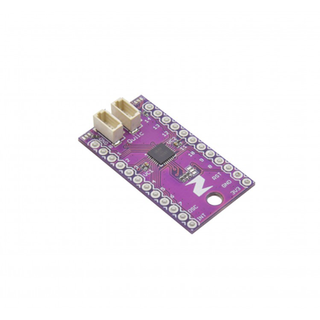

# Qwiic_IO_Expander

> This product can be available for purchase [here](https://www.smart-prototyping.com/Zio-Qwiic-IO-Expander.html).

#### Description

Running out of GPIO pins on the MCU controlling your Qwiic-based project? Add 16 extra, fully programmable GPIO pins with the Zio Qwiic I/O Expander. 

Another useful feature of this board is its ability to produce PWM signals enabling control of LEDs or any other PWM controllable device with a maximum 15mA output sink current.

The board is laid out so that it’s easy to solder components directly to it or for more flexible prototyping, solder on some header pins and drop in a breadboard. 

All I/O pins are 5.5V tolerant but we recommend voltages between 1.2-3.6V for optimal operation. The board has a 400kHz I2C compatible slave interface fast enough for most high-speed demanding projects and features an on-chip keypad scanning engine supporting up to 64 keys in an 8x8 matrix.

The I/O Expander features two Qwiic connectors for quick and easy daisy-chaining with other Qwiic-compatible I2C boards. 

> This PCB is a derivative of [Sparkfun's SX1509 IO-Expander](https://github.com/sparkfun/SX1509_IO-Expander), and can be used with their [Arduino library](https://github.com/sparkfun/SparkFun_SX1509_Arduino_Library).

> Note: As with all of the Version 1.0 Zio Qwiic boards, this board has been produced with the I2C pull-ups disconnected by default. If there's a significant length of wire between this board and your MCU, you'll need to solder closed the solder jumpers (labeled SDA, 3v3 and SCL) to connect the pull-up resistors to VCC.

##### Features

* Semtech SX1509
* 16 I/O Channels
* 1.2V to 3.6V low operating voltage.
* 5.5V Tolerant I/O up to 15mA output sink current on all I/Os.
* 2 Qwiic connectors
* 4 User selectable I2C compatible slave interface.
* PWM Intensity control (256-step PWM)

#### Specification

* Ultra-low current consumption of typically 1uA.
* -40°C to +85°C Operating Temperature Range
* 400kHz I2C compatible slave interface
* Blink and breathing control (224 On/Off values for each)
* Open drain active low interrupt output (NINT)
* Direct level shifting between I/O banks and host controller.
* IC: SX1509
* I2C address: 0x3E, 0x3F, 0x70, 0x71 (Default: 0x3E)
* Dimensions (LxWxH) 33x18mm
* Weight: 1.5g (0.06oz)

#### Links

* [SX1509 Datasheet](
* [SparkFun SX1509 Arduino Library](
* [Eagle files](

> ###### About Zio
> Zio is a new line of open sourced, compact, and grid layout boards, fully integrated for Arduino and Qwiic ecosystem. Designed ideally for wearables, robotics, small-space limitations or other on the go projects. Check out other awesome Zio products [here](https://www.smart-prototyping.com/Zio).

###### 

All Zio products are released under the [Creative Commons Attribution, Share-Alike License](https://creativecommons.org/licenses/by-sa/4.0/), and in accordance with the principles of the [Open Source Hardware Association's OSHW Statement of Principles 1.0 and OSHW Definition 1.0](https://www.oshwa.org/definition/).
